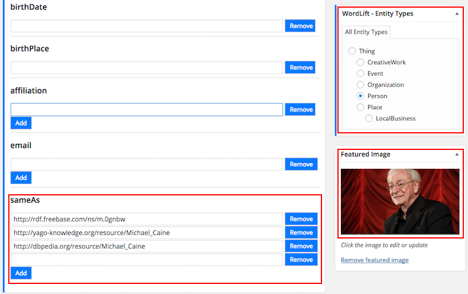
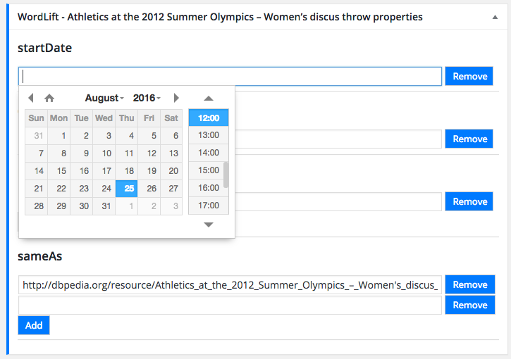
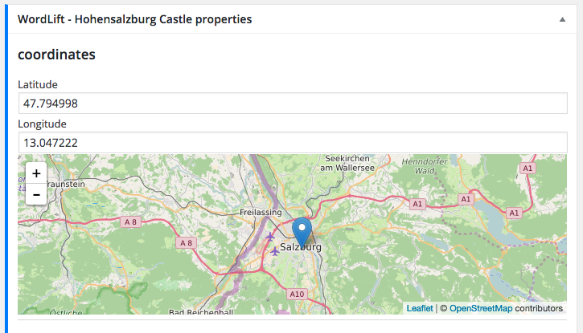
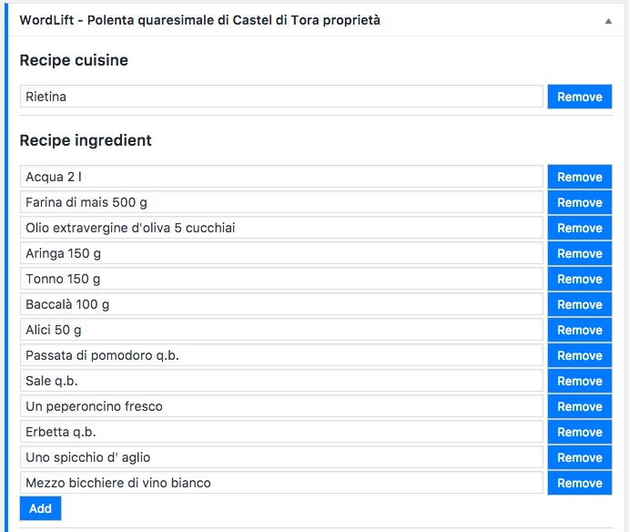
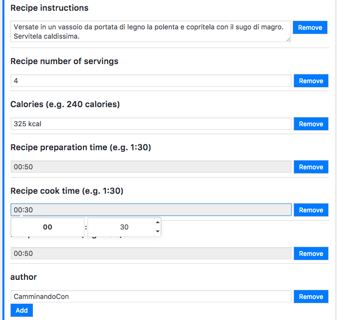
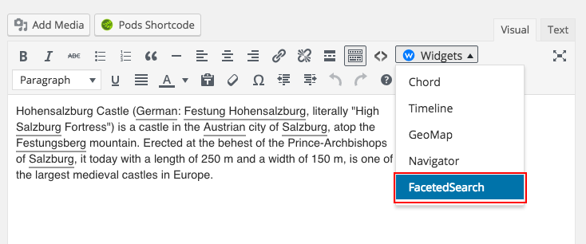

# Edit Entity

**WordLift** uses [entities](key-concepts#entity) to annotate and organize blog posts and pages.
All entities can be edited using the [WordLift Edit Post widget](analysis#wordLift-edit-post-widget) or from the **Entity Page** itself. To access all entities or add a new entity click on the **Vocabolary** icon on the dashboard menu.

When annotating a post with an entity WordLift adds a link to the **entity page**.
These links are useful for three reasons:

1. They allow users to navigate the website
2. They help establish information hierarchy using the network of entities
3. They could help spread link juice (ranking power) around the websites for better SEO.

Curating **entity pages** with WordLift is similar to writing an article on [Wikipedia](http://wikipedia.org). These *entity posts* are useful for:

- Providing contextual information to articles
- Aggregate all contents referring to the same entity

## Edit entity properties

The entity page provides the following set of properties that can be edited from the corresponding *meta box*:

> - **Name:** the title of the article
> - **Description:** the body of the article
> - **Image:** the featured image of the article
> - **Entity Types:** the corresponding type (i.e. *Thing*, *Person*, *Place*, *Event*, *Organization*, *Creative Work*, ...) that can be managed via the *WordLift - Entity Type* box in the editing window
> - **Permalink:** the URL describing the entity
> - **Same-As:** the URLs of same entity on the different sources

### Entity types and properties Table

Here follows the list of properties that can be edited with WordLift for each entity type.

| Type           | Description                                            | Properties                                                                                                                                                                            | Schema.org      |
| -------------- | ------------------------------------------------------ | ------------------------------------------------------------------------------------------------------------------------------------------------------------------------------------- | --------------- |
| Thing          | The most generic type of entity.                       | name,description,image, type,URL,sameAs, additionalType.                                                                                                                              | [Thing]         |
| Person         | A person.                                              | name,description,image, type,URL,sameAs, additionalType.                                                                                                                              | [Person]        |
| Place          | Entities with a physical extension.                    | name,description,image, type,URL,sameAs, additionalType,geo.                                                                                                                          | [Place]         |
| Event          | An event happening in a specific time and location.    | name,description,image, type,URL,sameAs, additionalType,location, startDate,endDate,performer, offers.                                                                                | [Event]         |
| Offer          | An offer.                                              | name,description,image, availability,price,URL, priceCurrency, availabilityStarts, availabilityEnds, inventoryLevel,validFrom, priceValidUntil,itemOffered.                           | [Offer]         |
| Organization   | An organization.                                       | name,description,image, type,URL,sameAs, additionalType,founder.                                                                                                                      | [Organization]  |
| Local business | A physical business or branch of an organization.      | name,description,image, type,URL,sameAs,address founder,geo.                                                                                                                          | [LocalBusiness] |
| Creative Work  | The most generic kind of Creative Work(i.e. Software). | name,description,image, type,URL,sameAs, additionalType.                                                                                                                              | [CreativeWork]  |
| Recipe         | A food recipe.                                         | name,description,image, type,URL,sameAs, additionalType, cookTime, prepTime, totalTime, recipeCuisine, recipeIngredient, recipeInstructions, recipeYield, author, nutrition.calories. | [Recipe]        |

### Edit an Event

Events, occuring in a specific time are also entities. To personalise the *startDate*, *endDate* and *location* of an event you can use the **Event Properties** box.

It is also possible to link an event with the *performer* (a presenter, a musician, or a group of speakers) by adding a reference to either a Person or an Organization.

Event can also be linked with an Offer - *this is an entity type* - that help us define for example the price for the tickets to an event.

### Edit a Place

Places are also entities. To personalise the *geo coordinates* (longitude and latitude) of a place I can use the **Coordinates** box and either edit the *Latitude* and *Longitude* fields or simply place the pinpoint on the map.

### Edit a Recipe

Recipes are also considered entities. To personalise *ingredients*, *cuisine*, *preparation time*, *cooking time*, *total time*, *number of portions*, *author* and *calories* I can edit the data using the Recipe meta boxes (make sure to choose the entity type *Recipe* in order to see these additional fields).

### Edit a Offer

An offer can be linked from an event and it helps us define for instance the pricing of an event.

## Updating the description

When we have something meanigful to say on a specific concept **we shall curate the information and edit the data that has been fetched automatically by WordLift** (*this will create our own version of Wikipedia*).

## Linking other entities

Entity pages can be annotated just like you would do with a blog posts.

After saving the new description you wrote, WordLift will analyze the text and suggest related entities. You can now *link* an entity with other entities. WordLift will store these relationships between one entity and other entities in the [graph](key-concepts#knowledge-graph) using the Dublin Core property `dct:related`. This information will be used to infer new connections between the contents of the site. For more information on *entity linking* [read the faq](faq#when-should-i-link-one-entity-to-another).

## The Faceted Search Widget

**Entity pages** can be used for helping users browse the content of your website. This is done using the **Faceted Search Widget**.
The Widget can be added on the entity page using the **Faceted Search** option from the [Widgets Dropodown Menu](analysis#wordlift-widgets-menu)

Alternatively, the `[wl_faceted_search]` shortcode can be used.

- **Faceted Search**
  : Provides a faceted search user interface to help readers discover relevant articles using the network of entities.

The example above represents the widget displayed in the front-end. The reader can select multiple concepts and highlight the list of articles related to these concepts.

## Save data

In order to save the information on the entity press the "Publish" button.
When making changes to an already existing entity press the "Update" button. In both cases data will be stored simultaneously on the WordPress site as well as in the [graph](key-concepts#knowledge-graph).

You can now continue to the [publish](publish) page.

[creativework]: http://schema.org/CreativeWork
[event]: http://schema.org/Event
[localbusiness]: http://schema.org/LocalBusiness
[offer]: http://schema.org/Offer
[organization]: http://schema.org/Organization
[person]: http://schema.org/Person
[place]: http://schema.org/Place
[recipe]: http://schema.org/Recipe
[thing]: http://schema.org/Thing
