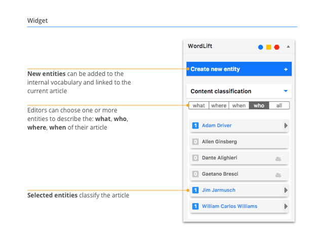
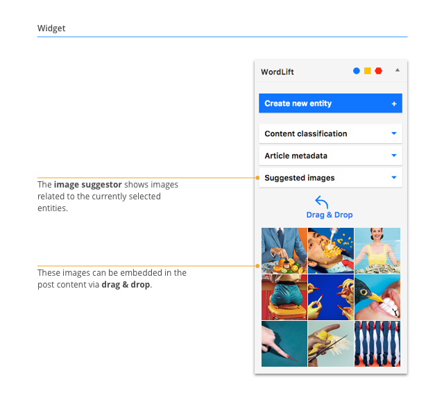

# Key Concepts

Here is the terminology describing the core concepts that will help you set up and manage your content with WordLift:

## Entity

An **entity** (or thing) is something that exists in the real-world: celebrities, cities, sport teams, buildings, geographical features, movies, celestial objects and works of art are all entities. For a long time, more than four decades, we've been teaching computers to recognise things by simply matching keywords.

Now computers, just like humans do, understand that a text like *\[Thubten Gyatso\]* is not just made of two words but, it has a much richer meaning. *\[Thubten Gyatso\]* is a person, more specifically he's the 13th Dalai Lama who was born in the Tsang-Ü province in Tibet on the 12th of February 1876.

All this information - collectively shared in public sources like Wikipedia and Freebase - is organised in intelligent models known as **Graphs** that are helping computers think the way we do and helping us find this information more quickly and even compute it (i.e. providing answers to question like *"Was Trinley Gyatso his predecessor?"*).

### Entity Types

Web pages are about many different kind of "things". WordLift uses the [Schema.org](http://schema.org) vocabulary to describe a variety of entity types, each of which has its own set of properties that can be used to describe the entity. The broadest item type is **Thing**, which has four properties: *name*, *description*, *url*, and *image*. WordLift supports all the entity types of the schema vocabulary.

### Related Entities

In WordLift **related entities** are primarily the entities being used for annotating a blog post or a page.
Each entity we curate can be eventually *linked* to other entities by running the analysis on its description text.
Entities being *linked* with other entities with the analysis are also known as **related entities**.

## Vocabulary

A **vocabulary** is a collection of things (or entities).

With WordLift, users can create their own custom vocabulary by creating entities and describing their properties (i.e. *\[Europe Day\]* is held on 9 May and celebrates peace and unity in Europe). These entities might already exist in publicly available sources like Wikipedia and Freebase. In this case WordLift provides a list of suggested entities that can be *linked* to (or reconciled with).

When linking entities to each other, WordLift uses the `owl:sameAs` property; this means that we're talking about the same *thing* (or simply that both entities share the same "identity"): "Yes, I'm talking about that same *\[Europe Day\]* that Freebase describes with machine id **m/04f6ymq**".

This linking process is also called [reconciliation] or disambiguation. Find out more on [how to import and export the user vocabulary](/pages/import-export-vocabulary).

## Knowledge Graph

A **knowledge graph** is a network of all kind of entities that are relevant to a specific domain or to an organization.
They are not limited to abstract concepts and relations (as with a vocabulary) but also contain the instances of the things they describe.

Using WordLift as new entities are added in the vocabulary, properties for these entities are populated using the
*ease-to-use* WordPress editing interfaces and new posts are enriched with these entities a knowledge graph is
created and published as [RDF](#rdf) graph in the cloud.

## RDF

**RDF** stands for Resource Description Framework.

RDF is a W3C standard language for representing information.

## Linked Open Data

**Linked Open Data** is [Linked Data](http://en.wikipedia.org/wiki/Linked_data) that is made available as **open content**.
Large linked open datasets (or [Knowledge Graph](#knowledge-graph)) include DBpedia and Freebase.

## Reconciliation

**Reconciling** entities we store in our own [vocabulary](#vocabulary) with entities available elsewhere provides computers with an unambiguous way to identify the things we're talking about.

*\[Apple\]* in a specific article might refer to a rather typical British psychedelic-pop band rather than to a World famous computer company or the forbidden fruit. This becomes important when third party applications like search engines need to provide valuable content for users searching for articles on *\[Apple\]* the psychedelic-pop band and not the other two *Apples*.

[Reconciling](#reconciliation) entities means providing computers with unambiguous identifications of the *entities* we talk about.

## Semantic Fingerprint

The result of semantic annotation of a text is a *unique linked identifier* added to the HTML code. This identifier is known as **semantic fingerprint**.

Annotating contents, also known as *semantic enrichment* or *lifting*, creates metadata that computers can understand.
Just like in forensic science human fingerprints are used to identify humans appearing on a crime scene, in computer science we use semantic fingerprints to tell computers what [entities](#entity) we're referring to.

WordLift re-uses these semantic fingerprints for adding Schema.org markup and for re-purposing contents using [Widgets](#widget).

## Dereferencing HTTP URIs

**URI Dereferencing** is the process of looking up a URI on the Web in order to get information about the referenced resource. WordLift uses dereferencing to obtain a snapshot of the properties describing a [named entity](#entity).

## Widget

A **widget** in WordLift is a dynamic visualisation that can be added by the editors to a page via [Shortcode](http://codex.wordpress.org/Shortcode) or using the WordLift menu.

A Widget is executed by the end-user's browser when accessing a page.
A Widget typically displays informations being stored in the [knowledge graph](#knowledge-graph) and creates dynamic connections between different posts or provides additional information about entities in the post.

## WordLift Edit Post Widget

Contents editors using WordLift can identify the basic '*who*, *what*, *when* and *where*' of an
article and structure information around it by creating new entities in the [custom vocabulary](#vocabulary). These annotations are added to the posts using the **WordLift Edit Post Widget**.

### Top down post annotation

The content editor, from the list of entities being detected in the text, uses these entities to describe his/her post without selecting any specific text annotations.
Entities being selected, in this case, describe the entire post (and not the single occurrence of the entity in the text).

### Bottom up entity annotation

The content editor has choosen the “Expo 2015” occurence in the text. In this case, this specific occurrence, is annotated with the entity "Expo 2015".

### Edit Entity Properties

The content editor is editing the main properties for the entity "Expo 2015" while writing the post.
The complete list of properties can be edited from the [Edit Entity](/pages/edit-entity) page.

### Image Suggestor

Images for each entity appear in the WordLift Edit Post Widget and can be dragged and dropped in the visual editor.

## WordLift key

The **WordLift key** is a *unique value* that is assigned to each user after he/she has subscribed to the WordLift service.

You can now continue to the [Analysis](/pages/analysis) page.
