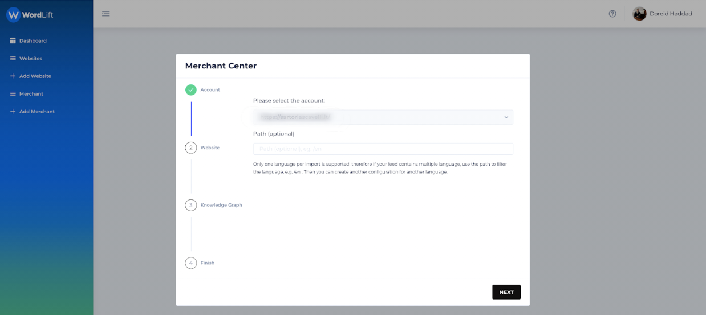
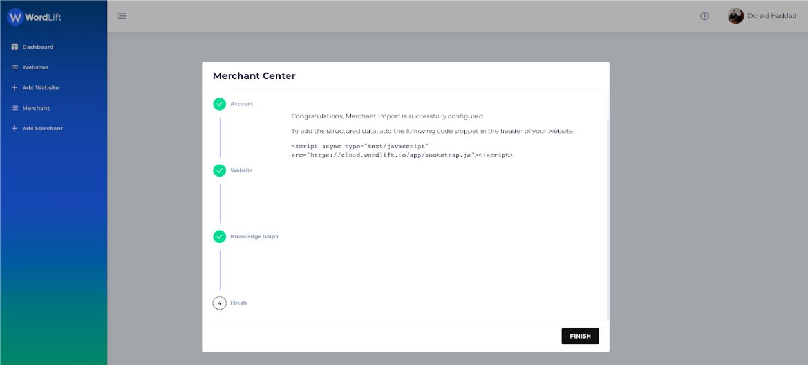

# Product Knowledge Graph Builder

**Product KG Builder** is the feature for e-commerce that allows you to automate your SEO and [create a product knowledge graph](https://wordlift.io/blog/en/how-build-product-knowledge-graph/) **with your Google Merchant Feed**.

This helps e-commerce to **communicate with Google's Shopping Graph and get free listings in Google Shopping**. At the same time, it **improves the user experience** by providing your customers with information that is relevant to their search.

WordLift Product KG Builder can make a difference in your e-commerce and positively **impact both organic traffic and sales**.

## Get Started

Once you have purchased the WordLift [Business+E-Commerce subscription](https://wordlift.io/business/) you will receive a key and then you will be able to access your dashboard.

The first step to start using your PKG Builder is to go to your dashboard and click on **+ Add Merchant** on the left side, then follow the simple steps in the wizard.

### 1. Link your Google Account

Sign in with your Google account.

### 2. Choose the Merchant Feed

Select the Merchant Feed you want to import.

At the moment, only one language per import is supported, therefore if your feed contains multiple languages, use the *Path* to filter the language, e.g. **/en** . Then you can create another configuration for another language.

### 3. Create your Product Knowledge Graph

Link the website and import the data from the Merchant Feed to the website.
To **create your Product Knowledge Graph** you need to add the script into your website.

Click *Finish*. Once you have completed these 3 steps, you will see that the **products** have been imported into the backend of your e-commerce website and **already enriched with structured data**.

From the WordLift dashboard, you can open the backend of your website and see the products imported and you can synchronize the data (it takes about 1 hour).
