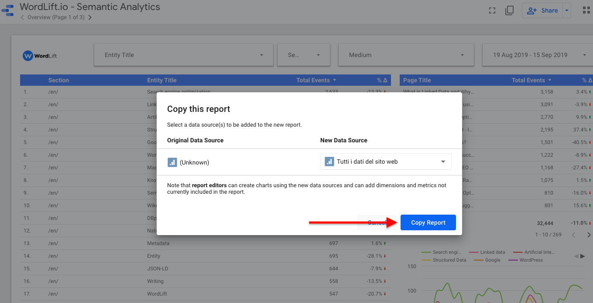

# Semantics Analytics

You can use **WordLift** to create an *entity-based* [Web Analytics Dashboard](https://wordlift.io/blog/en/semantic-web-analytics/) using Google Data Studio and traffic data from Google Analytics.

## How to configure Semantics Analytics

### Step One

Copy the Web Analytics Dashboard from [here](https://datastudio.google.com/u/0/reporting/1_Hu7hcfMhzE5EXDrZi3RTInZQcUjkiWt?s=l_0Vbo5t_bs).

### Step Two

On the pop-up window select “create new data source”.

### Step Three

Click on “select” under Google Analytics.

### Step Four

You will see a list of your current sites associated with your Google Analytics. Select the one you want to connect.

### Step Five

Go to the top right and click on “connect”.

### Step Six

Go to the top right and click on “add to report”.

### Step Seven

On the pop-up window click on “copy report”.

That’s it!

You will see showing up your Semantic Analytics visualization with the semantic data WordLift is sending to it.
Read this article on our blog ([Web Analytics Dashboard](https://wordlift.io/blog/en/semantic-web-analytics/)) to learn more about it.
