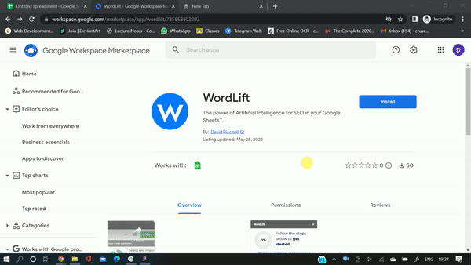
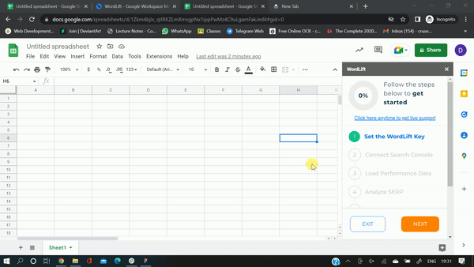
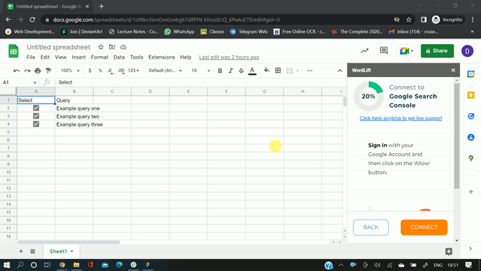
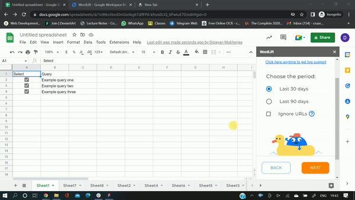
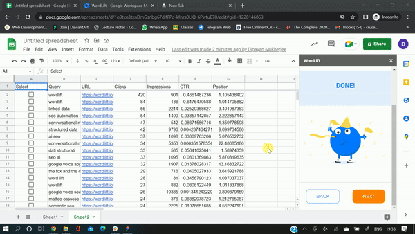
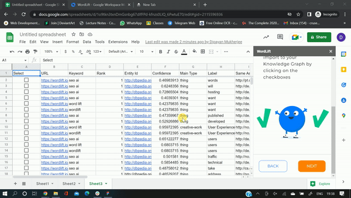

# SEO Add-On for Google Sheets

**SEO Add-on for Google Sheets™ by WordLift** is the extension that allows you to perform **semantic keyword research** and create a JSON-LD to help Google understand what your content is about.

With a few simple clicks, you can install the extension, connect it to your Google Search Console account, and **analyze the SERP** to find out which search queries rank highest on Google.

From there, you can see the **linked entities** and select the ones that are most relevant to your business to **import them directly into the Knowledge Graph**. To do this, simply copy and paste the JSON-LD page into your website. If you have WordLift, you can import the entities directly into your vocabulary with one click.

In this video you will learn what is SEO Add-On for Google Sheets and how it can help you to improve your SEO strategy.

<iframe src="https://www.youtube-nocookie.com/embed/_YSNUpZU8kY" width="100%" height="540" frameborder="0" scrolling="auto"></iframe>

## How it works

### 1. Installation

To install the SEO Add-on, open the Google Marketplace by clicking on the following link:

<a href="https://workspace.google.com/marketplace/app/wordlift/785668802292">https://workspace.google.com/marketplace/app/wordlift/785668802292</a>

Then click on the *Install* button, then the *Continue* button, and then click on *Allow* when requested.

### 2. Create Google Sheets

Once the SEO Add-on is installed, you can create a new Google Sheets™ document by clicking on this link, [sheets.new](http://sheets.new).

When in Google Sheets, open the SEO Add-on by clicking on the *Extensions* menu, the *WordLift*, and finally *Open*: the sidebar will show.

### 3. Configure Settings

Next step is to configure the **SEO Add-on settings**, click on the Next button in the sidebar.
You'll need a key for the SEO Add-on to work. Normally we prefill the key based on your e-mail address, but if you're using a different e-mail address with Google, you'll need to insert the key yourself.

You can also configure your **target geo market**, **language** and the **Google domain** to use for SERP analysis.

### 4. Connect Google Search Console

At this step, you'll connect to the **Google Search Console** to allow the **SEO Add-on** to pull the search performance data straight into Google Sheets. Click on the Connect button and then on *Allow*. Then select the website you want to pull the traffic data from.

### 5. Load Performance Data

Next choose the data time period and whether to include URLs in the report. URLs are useful if you want to target some specific URLs to improve their traffic, otherwise you can focus on search queries only.

### 6. Analyze SERP

Now it's time to select the queries (no more than 5) that we want to optimize. The SEO Add-on will scout the SERP and extract the relevant entities for the selected queries.
It may take a couple of minutes for the SEO Add-on to extract the results.

You can also bring your own queries, by inserting them in this sheet, or by creating a blank sheet, writing them down, then selecting them, and clicking on the Extensions menu, WordLift, Analyze SERP.

### 7. Import the Knowledge Graph

At this step, the SEO Add-on will create a list of the relevant entities along with additional data such as the related *keyword*, the *confidence score* (how sure we are about that entity) and the *rank* (the position in SERP where we found the entity).
You can now **select the relevant entities**. If you have WordPress with WordLift plugin we can import the entities straight into your knowledge graph, otherwise you can copy the JSON-LD from the sidebar into your own CMS or web page.

You can [build a Knowledge Graph from a SERP](https://wordlift.io/academy-entries/building-a-knowledge-graph-from-a-serp/) by using SEO Add-On for Google Sheets. To discover how you can do that, watch the video.

:::info Note
You can buy [SEO Add-On for Google Sheets](https://deals.thenextweb.com/sales/lifetime-subscription-wordlift-standard?aid=&utm_campaign=feed&utm_medium=RSS&utm_source=thenextweb) from TNW website.
:::

## Why is it asking for the country to be added?

This is because Google SERP is different from country to another and the top ranking results can be different. It’s important to understand that local versions of Google results look different depending on where you are searching from.

## How can the location affect the analysis?

Google's SERP changes depending on the location. Therefore, it is important to enter it before starting the search: only then will the results of the analysis be reliable for the market and audience your company is interested in.
