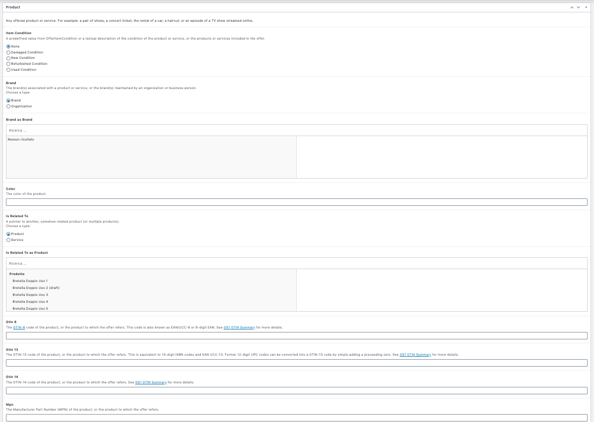
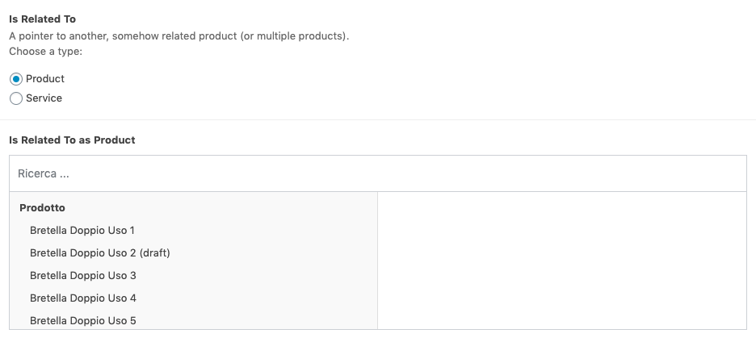
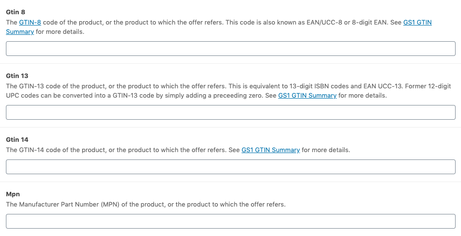
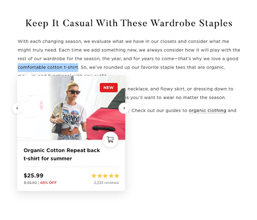

# WooCommerce SEO by WordLift

[WooCommerce SEO by WordLift](https://woocommerce.com/products/e-commerce-seo-by-wordlift/) has been specifically designed for e-commerce websites running on WordPress with WooCommerce.

E-commerce SEO by WordLift adds to your products **state-of-the-art structured data** and **extended product markup** that allows you to get more visibility on Google’s retail listing.

Furthermore, E-commerce SEO by WordLift allows you to create a **Product Graph** out of the relevant connections between products, brands, product categories, and features.

This e-commerce specific form of knowledge graph is a powerful tool to enhance the findability of your products. On one side, it helps you **get better results in terms of organic search traffic** and, on the other, it helps you improve the internal linking structure and **refine your product recommendations**.

**Overview**

WooCommerce SEO by WordLift enhances your Content Management System adding new features and allowing you to:

1. Produce **state-of-the-art structured linked data**
2. Add support for **extended mark-up properties**
3. Introduce **structured data on your category pages**
4. Create a **Product Graph** that improves the rankings
5. Connect **blog posts with products** and **product categories** with the Product Navigator and Product Faceted Search
6. Optimize **image sizes** as required by Google.

In this video you will learn how to add schema markup to your WooCommerce store with E-commerce SEO by WordLift.

<iframe src="https://www.youtube-nocookie.com/embed/om8wgy7IXfk" width="100%" height="540" frameborder="0" scrolling="auto"></iframe>

## Editors

The WooCommerce extension of WordLift adds **additional fields to the backend of your product page** so that you can better describe your products to semantic search engines like Google and make them more relevant and visible to your audience.

Here are the new custom fields that will appear in your WordPress Editor for Products. As you fill these fields, WordLift adds to your products an **extended product markup** that allows you to get more visibility on Google’s retail listing.

Looking more into the details, you will be able to add:

1. Product conditions, choosing from different options

2. Connect the product with the manufacturer (which can be a brand or an organization)

3. Say the color of the product (it’s a nice to have, if relevant)

4. Select related products or services

5. Add product codes if relevant in order to unambiguously refer to your products.

## Categories

You can turn category pages into entities by choosing an entity from your vocabulary. In this way, you will enrich category pages adding a layer of structured data.

To link a category to an existing entity, just type the name of the entity (a few letters will be enough) and then select it, then click on save.

## Widgets

### Products Navigator

The **Product Navigator** suggests to your customers a series of products that they might be interested in.

To add it to your product or article template just use this shortcode:
\[wl_products_navigator\]

The Product Navigator widget supports the same parameters as the Navigator.

*The Product Navigator of WordLift for WooCommerce on Oakley.com USA*

### Product Card

The Product Card allows the customers to see a preview of your product just placing their mouse over the link to the product itself. To activate the link and the Product Card just annotate the Product on your articles and pages. Learn more about [how to anotate your content](/pages/analysis#wordlift-edit-post-widget)

*How The Product Card of WordLift looks like on articles and other pages*

:::info Note
Read from our blog how to [improve your WooCommerce product pages](https://wordlift.io/blog/en/woocommerce-product-pages/) to increase your sales.
:::
