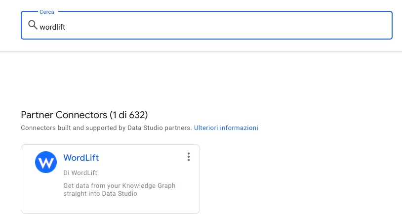
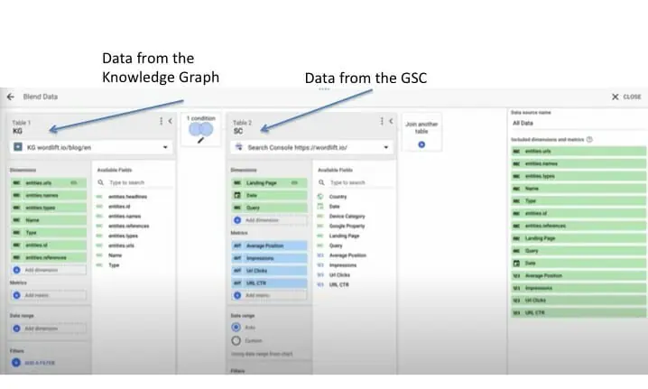

# WordLift Looker Studio Connector

With the [WordLift Looker Studio Connector](https://wordlift.io/blog/en/wordlift-data-studio-connector/), you can **create semantic SEO reports** by loading data from your Knowledge Graph directly into Looker Studio and merging it with Search Console or any other web analytics platform.

## Get Started

### 1. Search for it

The first step to start creating your semantic SEO report is to search for WordLift on the [Google Looker Studio connectors page](https://datastudio.google.com/datasources).



```{raw} html <video controls src="https://wordlift.io/blog/en/wp-content/uploads/sites/3/2022/08/semantic-seo-report.mp4"></video>
```

Just click on it and **enter the WordLift key**.

We have a GraphQL query ready for you, so you don’t need to do anything to get started. In case you are a power user and you know the query that you want to run, just continue. For example, if you are running an e-commerce website, maybe you want to query for product attributes or prices. Then be sure to keep checking the box “use report template for new report”, so you can get a shiny new report premade for you.

Then click **Connect**. Here you can see the fields that come from the report. Finally, click **Create Report**.


### 2. Add GSC as a data source and check the blend

At this point, you are close to creating your report, but two more steps are needed:

1. To go to the managed data sources and add your Search Console data source: choose your website, choose URL Impressions anche choose Web Type, and then click on Create.
2. Check the blends to verify that the data is merged from the Knowledge Graph and GSC.



You can filter the data for EntityType and choose the period of time you prefer.

:::note
Learn how to [create your Semantic SEO reports](https://youtu.be/mWMEbx3qIVI) in 3 simple steps, watch this video.
:::

```{raw} html
<div style="position: relative; padding-bottom: 56.25%; height: 0; overflow: hidden; max-width: 100%; height: auto;">
    <iframe src="https://www.youtube-nocookie.com/embed/mWMEbx3qIVI" frameborder="0" allowfullscreen style="position: absolute; top: 0; left: 0; width: 100%; height: 100%;"></iframe>
</div>
```
