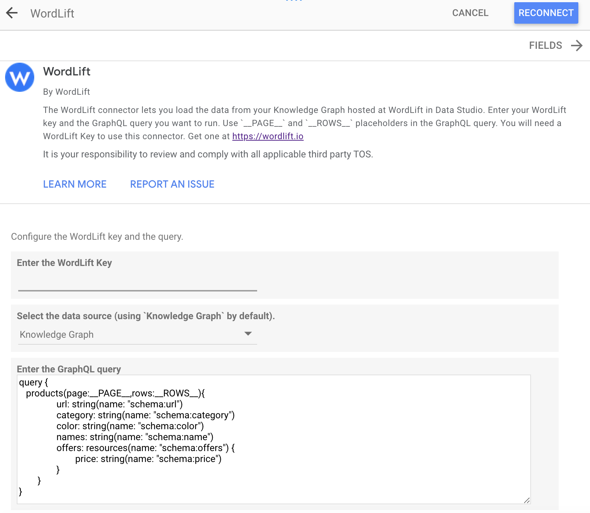

# Advanced Topics

## Knowledge Graph

A **knowledge graph** is a network of all kind of entities that are relevant to a specific domain or to an organization.
They are not limited to abstract concepts and relations (as with a vocabulary) but also contain the instances of the things they describe.

Using WordLift as new entities are added in the vocabulary, properties for these entities are populated using the
*ease-to-use* WordPress editing interfaces and new posts are enriched with these entities a knowledge graph is
created and published as [RDF](#rdf) graph in the cloud.

### Linked Data

**Linked Open Data** is [Linked Data](http://en.wikipedia.org/wiki/Linked_data) that is made available as **open content**.
Large linked open datasets (or [Knowledge Graph](#knowledge-graph)) include DBpedia and Freebase.

### Reconciliation

**Reconciling** entities we store in our own [vocabulary](#system-message-1) with entities available elsewhere provides computers with an unambiguous way to identify the things we're talking about.

*\[Apple\]* in a specific article might refer to a rather typical British psychedelic-pop band rather than to a World famous computer company or the forbidden fruit. This becomes important when third party applications like search engines need to provide valuable content for users searching for articles on *\[Apple\]* the psychedelic-pop band and not the other two *Apples*.

[Reconciling](/pages/key-concepts#reconciliation) entities means providing computers with unambiguous identifications of the *entities* we talk about.

## RDF

**RDF** stands for Resource Description Framework.

RDF is a W3C standard language for representing information.

## Semantic Fingerprint

The result of semantic annotation of a text is a *unique linked identifier* added to the HTML code. This identifier is known as **semantic fingerprint**.

Annotating contents, also known as *semantic enrichment* or *lifting*, creates metadata that computers can understand.
Just like in forensic science human fingerprints are used to identify humans appearing on a crime scene, in computer science we use semantic fingerprints to tell computers what [entities](/pages/key-concepts#entity) we're referring to.

WordLift re-uses these semantic fingerprints for adding Schema.org markup and for re-purposing contents using [Widgets](/pages/key-concepts#widget).

## Dereferencing HTTP URIs

**URI Dereferencing** is the process of looking up a URI on the Web in order to get information about the referenced resource. WordLift uses dereferencing to obtain a snapshot of the properties describing a [named entity](/pages/key-concepts#entity).

## Semantic Analytics with WordLift Looker Studio Connector

WordLift's Looker Studio Connector offers a powerful way to create semantic SEO reports. It allows you to blend data from various sources like Google Analytics, Google Search Console, and your own proprietary databases to create informative dashboards and reports. Below is how you can leverage it for semantic analytics:

#### What is Google Looker Studio?

[Google Looker Studio](https://support.google.com/datastudio/answer/6283323?hl=en) is a free data visualization tool that allows you to collect data in easy-to-read, shareable, and fully customizable dashboards and reports.

#### How to Create Semantic SEO Reports

1. **Structured Data**: Adding structured data to your website enriches your content, allowing search engines to better understand it. This can lead to better rankings and more organic traffic.

2. **Entities and Concepts**: Google is shifting its focus from just keywords to concepts and entities. With WordLift, you can work with entities on your website to improve your semantic SEO strategy.

3. **WordLift Looker Studio Connector**: Use the [Looker Studio Connector](https://docs.wordlift.io/looker-studio-connector/introduction/) to blend data from your Knowledge Graph with other analytics platforms like Google Search Console.
    - **Getting Started**: Search for WordLift on the [Google Looker Studio connectors page](https://datastudio.google.com/datasources/create?connectorId=AKfycbwxx5Jf1KKHeKItCkwzJsrW2iOhodliNcud1vk5HKimj1lUQLuVfcAD4K9oSFmqW8v-). Follow the instructions to connect.
    - **Data Blending**: Blend data from the Knowledge Graph and Google Search Console to create comprehensive reports.

#### Benefits

- **Single Source of Truth**: Create a unified dashboard for all your SEO and business performance metrics.
- **Audience Insights**: Gain meaningful data about your content and audience.
- **SEO Reporting**: Take your SEO reporting to the next level with insights into keyword rankings, traffic, and more.

For more details, you can read the [WordLift Looker Studio Connector blog post](https://wordlift.io/blog/en/wordlift-looker-studio-connector/).

## Automatic Pagination and Table of Contents

**Pagination** allows website editors to split long content into different pages. This technique really belongs to the ABC of web design and information architecture, but — still — **pagination SEO best practices are debated**. Therefore, dealing with it is not that easy as it could seem.

Want to learn more about it? Head over to our blog post that covers the application of an [SEO friendly pagination](https://wordlift.io/blog/en/pagination-seo-wordpress-plugin/) .

## Image SEO

Images greatly contribute to a website’s SEO and improve the overall user experience. Fully optimizing images is about helping users, and search engines, better understand the content of an article.

Head over to our blog that tackles [the optimization of images using machine learning](https://wordlift.io/blog/en/image-seo-using-ai/)
