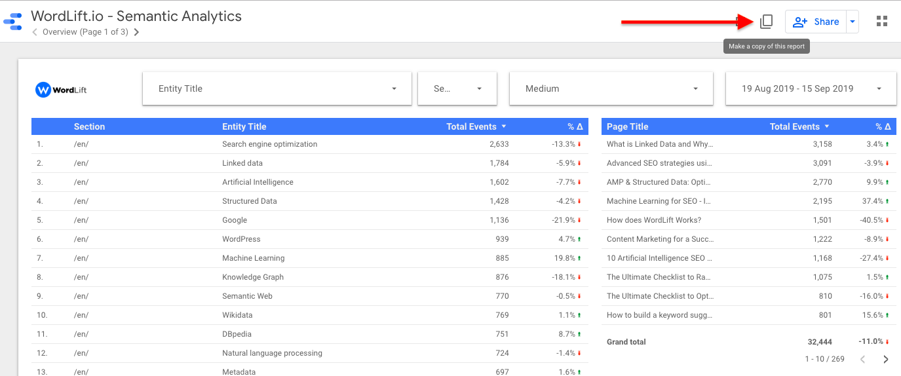
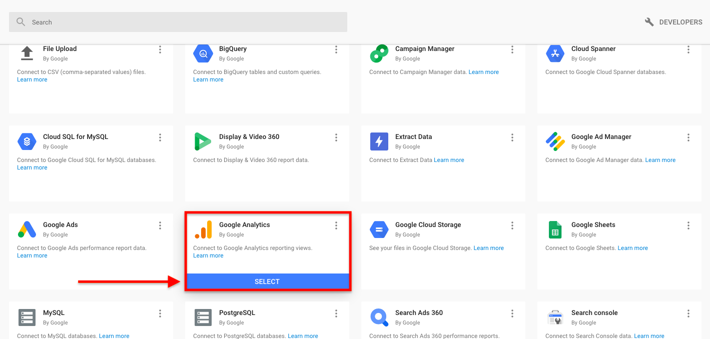
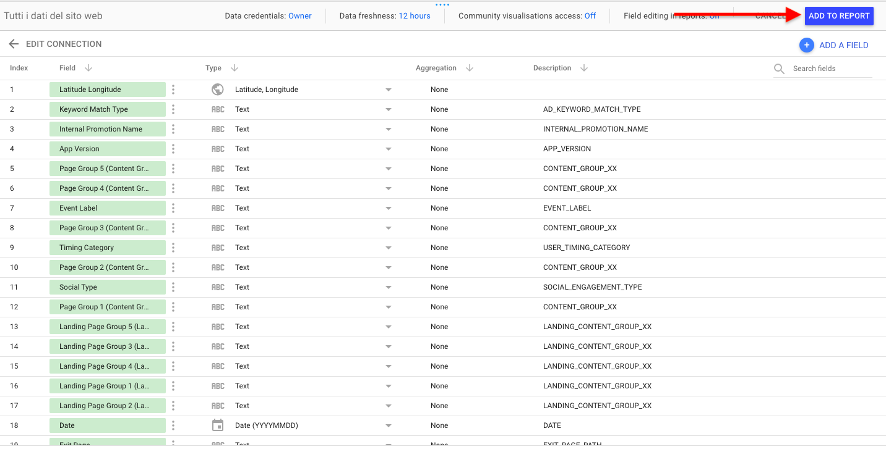

# Advanced Topics

## Knowledge Graph

A **knowledge graph** is a network of all kind of entities that are relevant to a specific domain or to an organization.
They are not limited to abstract concepts and relations (as with a vocabulary) but also contain the instances of the things they describe.

Using WordLift as new entities are added in the vocabulary, properties for these entities are populated using the
*ease-to-use* WordPress editing interfaces and new posts are enriched with these entities a knowledge graph is
created and published as [RDF](#rdf) graph in the cloud.

### Linked Data

**Linked Open Data** is [Linked Data](http://en.wikipedia.org/wiki/Linked_data) that is made available as **open content**.
Large linked open datasets (or [Knowledge Graph](#knowledge-graph)) include DBpedia and Freebase.

### Reconciliation

**Reconciling** entities we store in our own [vocabulary](#system-message-1) with entities available elsewhere provides computers with an unambiguous way to identify the things we're talking about.

*\[Apple\]* in a specific article might refer to a rather typical British psychedelic-pop band rather than to a World famous computer company or the forbidden fruit. This becomes important when third party applications like search engines need to provide valuable content for users searching for articles on *\[Apple\]* the psychedelic-pop band and not the other two *Apples*.

[Reconciling](../pages/key-concepts#reconciliation) entities means providing computers with unambiguous identifications of the *entities* we talk about.

## RDF

**RDF** stands for Resource Description Framework.

RDF is a W3C standard language for representing information.

## Semantic Fingerprint

The result of semantic annotation of a text is a *unique linked identifier* added to the HTML code. This identifier is known as **semantic fingerprint**.

Annotating contents, also known as *semantic enrichment* or *lifting*, creates metadata that computers can understand.
Just like in forensic science human fingerprints are used to identify humans appearing on a crime scene, in computer science we use semantic fingerprints to tell computers what [entities](../pages/key-concepts#entity) we're referring to.

WordLift re-uses these semantic fingerprints for adding Schema.org markup and for re-purposing contents using [Widgets](../pages/key-concepts#widget).

## Dereferencing HTTP URIs

**URI Dereferencing** is the process of looking up a URI on the Web in order to get information about the referenced resource. WordLift uses dereferencing to obtain a snapshot of the properties describing a [named entity]../pages/key-concepts#entity).

## Semantic Analytics

You can use **WordLift** to create an *entity-based* [Web Analytics Dashboard](https://wordlift.io/blog/en/semantic-web-analytics/) using Google Data Studio and traffic data from Google Analytics.

### How to configure Semantics Analytics

#### Step One

Copy the Web Analytics Dashboard from [here](https://datastudio.google.com/u/0/reporting/1_Hu7hcfMhzE5EXDrZi3RTInZQcUjkiWt?s=l_0Vbo5t_bs).

#### Step Two

On the pop-up window select “create new data source”.

#### Step Three

Click on “select” under Google Analytics.

#### Step Four

You will see a list of your current sites associated with your Google Analytics. Select the one you want to connect.

#### Step Five

Go to the top right and click on “connect”.

#### Step Six

Go to the top right and click on “add to report”.

#### Step Seven

On the pop-up window click on “copy report”.

That’s it!

You will see showing up your Semantic Analytics visualization with the semantic data WordLift is sending to it.
Read this article on our blog ([Web Analytics Dashboard](https://wordlift.io/blog/en/semantic-web-analytics/)) to learn more about it.

## Automatic Pagination and Table of Contents

**Pagination** allows website editors to split long content into different pages. This technique really belongs to the ABC of web design and information architecture, but — still — **pagination SEO best practices are debated**. Therefore, dealing with it is not that easy as it could seem.

Want to learn more about it? Head over to our blog post that covers the application of an [SEO friendly pagination](https://wordlift.io/blog/en/pagination-seo-wordpress-plugin/) .

## Image SEO

Images greatly contribute to a website’s SEO and improve the overall user experience. Fully optimizing images is about helping users, and search engines, better understand the content of an article.

Head over to our blog that tackles [the optimization of images using machine learning](https://wordlift.io/blog/en/image-seo-using-ai/)
